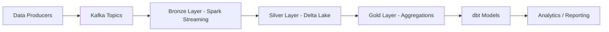

# Market Pulse

Market Pulse is a streaming data engineering project that demonstrates how to build a modern data platform for market intelligence. It ingests financial and news data from public APIs, publishes it through Kafka, processes it with Apache Spark Structured Streaming, stores it in Delta Lake, and exposes curated datasets through dbt.

This repository is designed for learning, prototyping, and demonstrating an end-to-end data pipeline using real-world tools such as Kafka, Spark, Delta Lake, and dbt.

---

## 1. Project Overview

The platform collects the following data streams:

- Stock prices
- Market news articles and sentiment
- Foreign exchange rates

It processes the data through the following layers:

- Bronze: raw ingestion from Kafka into Delta Lake
- Silver: schema enforcement, parsing, deduplication, and watermarking
- Gold: aggregate analytics for reporting and downstream consumption

---

## 2. Architecture



### Data Flow

1. Producer scripts fetch external market data.
2. Records are sent to Kafka topics.
3. Spark Structured Streaming reads from Kafka and writes to Delta tables in the Bronze layer.
4. A second Spark job transforms and enriches the Bronze data into Silver tables.
5. A gold-layer aggregation job produces summary tables.
6. dbt models consume and transform the curated datasets.

---

## 3. Tech Stack

- Python 3.10+
- Kafka
- Apache Spark 3.5+
- Delta Lake
- dbt Core
- Docker and Docker Compose
- Delta tables stored under the data/ directory

---

## 4. Repository Structure

```text
.
├── data/
│   ├── delta/
│   │   ├── bronze/
│   │   ├── silver/
│   │   └── gold/
│   └── spark/
│       └── checkpoints/
├── producers/
│   ├── jobs/
│   │   ├── fx_producer.py
│   │   ├── news_producer.py
│   │   └── stock_price_producer.py
│   └── requirements.txt
├── spark/
│   ├── jobs/
│   │   ├── bronze_layers.py
│   │   ├── silver_layers.py
│   │   └── gold_layers.py
│   └── requirements.txt
├── pulse_dbt/
│   ├── models/
│   ├── macros/
│   ├── tests/
│   ├── dbt_project.yml
│   └── requirements.txt
├── docker-compose.yml
└── README.md
```

### Main Components

- producers/jobs/fx_producer.py
  - Pulls FX exchange rate data from Frankfurter API
  - Publishes to the fx-rates Kafka topic

- producers/jobs/news_producer.py
  - Pulls market news from NewsAPI
  - Calculates sentiment with TextBlob
  - Publishes to the news-posts topic

- producers/jobs/stock_price_producer.py
  - Pulls stock price data from Twelve Data API
  - Publishes to the stock-prices topic

- spark/jobs/bronze_layers.py
  - Reads Kafka topics into the Bronze Delta layer

- spark/jobs/silver_layers.py
  - Parses JSON payloads, applies schemas, and writes cleaned Silver data

- spark/jobs/gold_layers.py
  - Produces windowed aggregations for analytics

- pulse_dbt/models
  - Contains dbt staging and mart-layer SQL models

---

## 5. Prerequisites

Make sure the following are installed on your machine:

- Docker Desktop or Docker Engine
- Docker Compose
- Python 3.10+
- pip
- Internet access for external APIs

If you want to run Spark locally outside Docker, also ensure Java is installed and available on the PATH.

### Important project notes

- The producer scripts publish to Kafka on `localhost:9092` from the host machine, so they are intended to run from the same environment that is reaching Dockerized Kafka.
- The Spark jobs write Delta tables under the `data/delta` folder and checkpoint state under `data/spark/checkpoints`.
- If you change those output paths, update the matching paths in the dbt source definitions in [pulse_dbt/models/sources.yml](pulse_dbt/models/sources.yml).

---

## 6. Setup Instructions

### 6.1 Clone the Repository

```bash
git clone <repo-url>
cd Market.Pulse
```

### 6.2 Create a Python Virtual Environment

```bash
python3 -m venv .venv
source .venv/bin/activate
```

### 6.3 Install Python Dependencies

```bash
pip install -r producers/requirements.txt
pip install -r spark/requirements.txt
pip install -r pulse_dbt/requirements.txt
```

### 6.4 Set Required Environment Variables

The producers depend on external APIs, so export your keys before running them:

```bash
export NEWS_API_KEY="your_news_api_key"
export TWELVE_DATA_API_KEY="your_twelve_data_api_key"
```

> The repository contains sample/default values in the producer code, but you should replace them with your own credentials for reliable usage.

---

## 7. Start the Infrastructure

The project uses Docker Compose to run Kafka and Spark services.

```bash
docker compose up -d zookeeper kafka spark-master
sleep 10
docker compose up -d spark-worker
```

To verify the containers are running:

```bash
docker compose ps
```

Useful service endpoints:

- Kafka: localhost:9092
- Spark Master UI: http://localhost:8080
- Spark Thrift Server: localhost:10000

---

## 8. Start the Data Producers

Open separate terminal sessions and run the producers.

### FX Producer

```bash
source .venv/bin/activate
python producers/jobs/fx_producer.py
```

### News Producer

```bash
source .venv/bin/activate
python producers/jobs/news_producer.py
```

### Stock Price Producer

```bash
source .venv/bin/activate
python producers/jobs/stock_price_producer.py
```

These scripts will publish messages into the Kafka topics:

- fx-rates
- news-posts
- stock-prices

You can verify the topics with:

```bash
docker compose exec kafka kafka-topics --list --bootstrap-server localhost:9092
```

---

## 9. Start the Spark Streaming Jobs

Run the jobs from the repository root.

### Bronze Layer

```bash
SPARK_MASTER=spark://localhost:7077

spark-submit \
  --master "$SPARK_MASTER" \
  --packages org.apache.spark:spark-sql-kafka-0-10_2.12:3.5.0,io.delta:delta-spark_2.12:3.1.0 \
  spark/jobs/bronze_layers.py
```

### Silver Layer

```bash
SPARK_MASTER=spark://localhost:7077

spark-submit \
  --master "$SPARK_MASTER" \
  --packages io.delta:delta-spark_2.12:3.1.0 \
  spark/jobs/silver_layers.py
```

### Gold Layer

```bash
SPARK_MASTER=spark://localhost:7077

spark-submit \
  --master "$SPARK_MASTER" \
  --packages io.delta:delta-spark_2.12:3.1.0 \
  spark/jobs/gold_layers.py
```

If you are running Spark from inside the Docker network, use `spark://spark-master:7077` instead of `spark://localhost:7077`.

---

## 10. Start the Spark Thrift Server for dbt

dbt connects to Spark over the Thrift server. Start it before running dbt models:

```bash
SPARK_MASTER=spark://localhost:7077

/opt/spark/sbin/start-thriftserver.sh \
  --master "$SPARK_MASTER" \
  --packages io.delta:delta-spark_2.12:3.1.0 \
  --conf spark.sql.extensions=io.delta.sql.DeltaSparkSessionExtension \
  --conf spark.sql.catalog.spark_catalog=org.apache.spark.sql.delta.catalog.DeltaCatalog \
  --hiveconf hive.server2.thrift.port=10000
```

If you run the Thrift server from inside the Docker Compose network, use `spark://spark-master:7077` as the master value.

## 11. Run dbt Models

Navigate to the dbt project directory and initialize the environment.

```bash
cd pulse_dbt

pip install -r requirements.txt
dbt deps
dbt debug
dbt run
dbt test
```

The dbt project is configured to work with the Delta Lake outputs generated by Spark. If the output paths change, update the corresponding external locations in [pulse_dbt/models/sources.yml](pulse_dbt/models/sources.yml).

### dbt Profile

The project points to the `market_pulse` profile in [pulse_dbt/dbt_project.yml](pulse_dbt/dbt_project.yml). That profile is not stored inside the repository; it must be defined in your local dbt configuration file, usually `~/.dbt/profiles.yml`.

Add the following entry to your local dbt profile:

```yaml
market_pulse:
  target: dev
  outputs:
    dev:
      type: spark
      method: thrift
      host: localhost
      port: 10000
      schema: market_pulse
      connect_retries: 3
      connect_timeout: 30
      threads: 4
```

If you prefer a different location, point dbt to it with the `DBT_PROFILES_DIR` environment variable.

---

## 12. Validate the Pipeline

You can verify that data is flowing through the system using these checks:

### Check Kafka topics

```bash
docker compose exec kafka kafka-topics --list --bootstrap-server localhost:9092
```

### Inspect Delta output folders

```bash
find data/delta -maxdepth 3 -type d | sort
```

### Review Spark logs

```bash
docker compose logs -f spark-master spark-worker
```

### Inspect dbt results

```bash
cd pulse_dbt
cat target/run_results.json
```

---

## 13. Common Commands

### Stop all services

```bash
docker compose down
```

### Rebuild containers

```bash
docker compose up -d --build
```

### View logs

```bash
docker compose logs -f
```

---

## 14. Notes and Recommendations

- This project is a strong example of a modern batch/streaming data platform, but it is not yet production-hardened.
- Use environment variables for API keys instead of hardcoding secrets.
- For production, you would typically add monitoring, alerting, schema registry, Airflow or Prefect orchestration, and a dashboard layer.
- Ensure the dbt source locations match the actual Delta paths created by Spark if you change the storage layout.

---

## 15. Suggested Next Enhancements

- Add Airflow for orchestration
- Add a Streamlit or Dash dashboard
- Add unit and integration tests
- Add CI/CD pipelines
- Add schema validation and data quality checks
- Add containerized dbt execution

---

## 16. Summary

Market Pulse is a practical end-to-end streaming analytics project that demonstrates:

- real-time data ingestion
- event streaming with Kafka
- transformation with Spark Structured Streaming
- lakehouse storage with Delta Lake
- analytics modeling with dbt

It is an excellent reference project for understanding how modern data engineering pipelines are built and operated.
